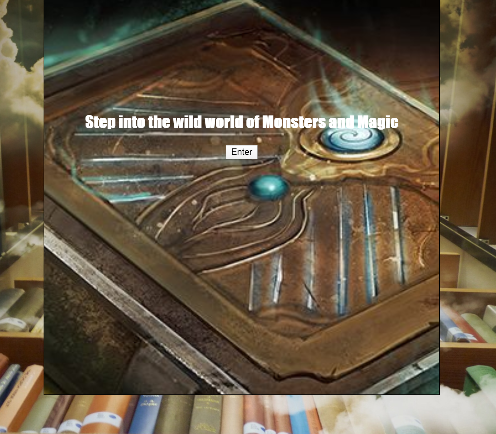

<h1>DnD Monster Library</h1>

Explore a wealth of spells and beastiaries with this ever-expanding app which takes you into the equally expansive world of Dungeons and Dragons

<h2>Motivation</h2>
    
Tabletop is fun, but buying many books for it is not. That is what drove me to create a codex for players and dms alike to look up spells and monsters alike. Who knows? There might be even more to come in my codex app.

<h2>Demo</h2>
<a href="https://royzone96.github.io/dnd-library/">Live Demo</a>
<h2>Screenshots</h2>
    <h3>Beginning Page:</h3>
        
    <h3>Search Idle Page</h3>
        
    <h3>Search Result Page: News Section</h3>
        
<h2>Built With</h2>
    <h3>Front-End</h3>
        <ul>
            <li>HTML</li>
            <li>CSS</li>
            <li>JavaScript</li>
            <li>jQuery</li>
        </ul>
<h2>Features</h2>
    <ul>
        <li>An ever expanding lexicon of spells and abilities.</li>
        <li>Plan your adventures by looking up potential monsters for your intrepid adventures to stand against</li>
        <li>Search results page displays with the following content sections</li>
        <li>Access this well of knowledge on both computer and on mobile devices</li>
    </ul>
<h2>Environment Setup</h2>
    
No API key is needed for this application
.<h2>Development Road Map</h2>
    <ul>
        <li>Will condense the search function to just one bar</li>
        <li>More content added down the line</li>
        <li>Adding a function to change the language of the appended </li>
    </ul>
